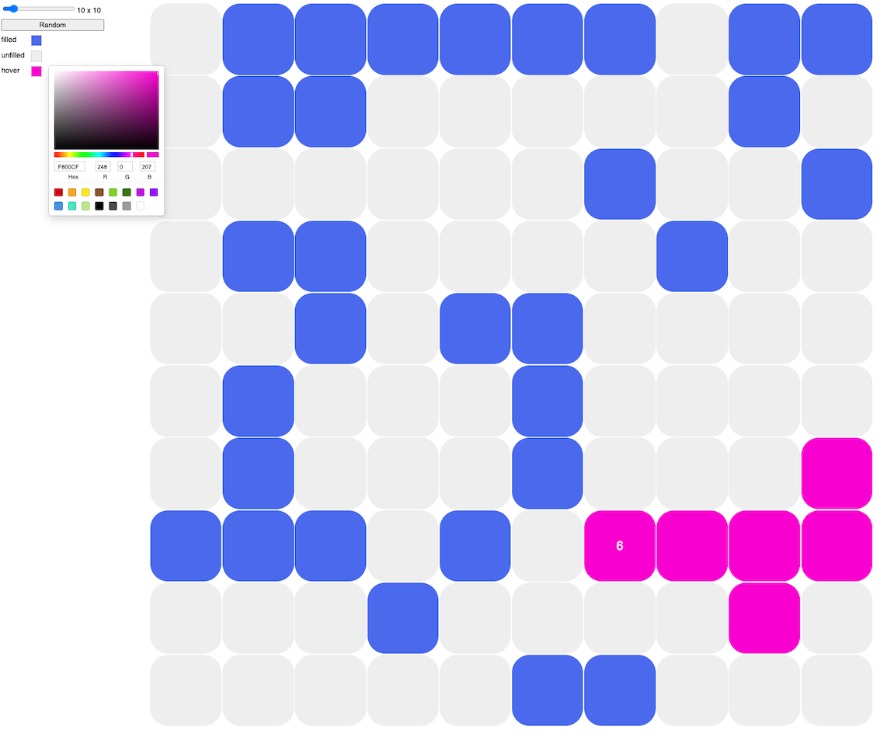

# grid-viz

## Running Locally

`yarn && yarn start`

## Points of Interest

`/app/ui/grid/lib/grid-traverse.ts ` uses depth first search to traverse the grid.

`/app/ui/grid/Grid.tsx` uses `useReducer` in combination with a `ContextProvider` to provide  `{ state, dispatch }` to all descendant components.

`/app/ui/grid/Cell.tsx` uses `useContext` to retrieve `dispatch` from context to trigger grid reducer actions.

`/app/ui/grid/reducers/grid.ts` grid reducer where grid is traversed following cell clicks and hovers.

## Improvements

Possible improvements:
- performance optimisation: rather than traverse the UI grid traverse a simpler representation. Would also decouple traversal from UI.
- more testing of UI components
